# Frontend & Client Platform Full Support Design

> Date: 2026-06-16
> Status: DRAFT — Pending approval

## Background

### Problem Statement

`/understand` and `/understand-domain` were designed primarily for backend/server-side codebases. While basic language-level support exists for frontend (TypeScript, JavaScript, HTML, CSS) and client (Kotlin, Swift, ObjC, Dart) languages, the **framework-level intelligence** and **domain extraction logic** are severely lacking for frontend (Web Vue React) and client (Android iOS) platforms.

**Current support matrix:**

| Platform | /understand | /understand-domain |
|---|---|---|
| Web Frontend (Vue/React) | ⭐⭐⭐⭐ Good (has addendum) | ⭐⭐ Poor (backend-biased entry detection) |
| Web Frontend (Nuxt/Svelte) | ⭐⭐ Poor (no addendum) | ⭐⭐ Poor |
| iOS Client | ⭐⭐⭐ Fair (lang ok, no framework addendum) | ⭐ Very Poor (almost no support) |
| Android Client | ⭐⭐⭐ Fair (lang ok, no framework addendum) | ⭐ Very Poor (almost no support) |
| Flutter | ⭐⭐⭐⭐ Good (has addendum) | ⭐⭐ Poor |
| React Native | ⭐⭐ Poor (no addendum) | ⭐ Very Poor |

### Root Causes

#### /understand gaps:

1. **Missing framework addendums** — No `frameworks/android.md` or `frameworks/ios.md`. The file-analyzer and architecture-analyzer lack guidance on client-specific patterns (Activity lifecycle, ViewController hierarchy, Compose Screens, Navigation Graphs)
2. **Entry point detection blind spots** — Phase 0 doesn't check for `MainActivity.kt`, `AppDelegate.swift`, `*App.swift` (@main)
3. **No `navigates_to` edge guidance** — Client apps' core relationship is screen-to-screen navigation, but current addendums don't instruct edge creation for navigation

#### /understand-domain gaps:

1. **Entry point patterns in `extract-domain-context.py` are entirely backend-focused** — Only detects HTTP routes, CLI commands, Event listeners, Cron schedules. Misses: Vue Router definitions, React Router Routes, Activity declarations, Screen composables, ViewController classes
2. **`domain-flow-extractor` only traces `calls` edges** — Frontend/client business flows follow user journeys: Screen → Interaction → State Change → API Call → UI Update. Needs to also trace `routes`, `depends_on`, `subscribes`, `publishes` edges
3. **`domain-discoverer` splits by API endpoint groups** — Frontend/client should split by feature module / screen group / page group
4. **`condense_kg_for_domain.py` loses navigation topology** — Frontend's core is "Page + Component + State" triad, navigation relationships must survive condensation

---

## Architecture

### Component Impact Map

```mermaid
graph TD
    subgraph "/understand changes"
        FW_ANDROID[frameworks/android.md<br/>NEW]
        FW_IOS[frameworks/ios.md<br/>NEW]
        FW_RN[frameworks/react-native.md<br/>NEW]
        FW_ANGULAR[frameworks/angular.md<br/>NEW]
        FW_NUXT[frameworks/nuxt.md<br/>NEW]
        FW_UNIAPP[frameworks/uni-app.md<br/>NEW]
        SKILL_ENTRY[SKILL.md Phase 0<br/>entry point list MODIFY]
        SCHEMA[schema-reference.md<br/>navigates_to edge MODIFY]
    end

    subgraph "/understand-domain changes"
        EDC[extract-domain-context.py<br/>entry point patterns MODIFY]
        DFE[domain-flow-extractor.md<br/>add client flow rules MODIFY]
        DD[domain-discoverer.md<br/>add feature-module heuristic MODIFY]
        CKG[condense_kg_for_domain.py<br/>preserve navigation edges MODIFY]
    end

    FW_ANDROID --> |injects into| FA[file-analyzer]
    FW_IOS --> |injects into| FA
    FW_ANDROID --> |injects into| AA[architecture-analyzer]
    FW_IOS --> |injects into| AA
    SCHEMA --> |new edge type| FA
    EDC --> |feeds| DA[domain-analyzer]
    DFE --> |guides| DFE_AGENT[domain-flow-extractor agent]
```



---

## Detailed Design

### Part A: /understand Enhancements

#### A1. New Framework Addendum: `frameworks/android.md`

Covers Jetpack Compose + traditional View System + common architectures (MVVM, MVI, Clean Architecture).

**Key sections:**
- Canonical File Roles: Activity, Fragment, Composable Screen, ViewModel, Repository, UseCase, DAO, Entity, Navigation Graph, AndroidManifest.xml, res/layout/*.xml
- Edge Patterns: Activity→Fragment (contains), Fragment→ViewModel (depends_on), ViewModel→Repository (depends_on), Compose NavHost→Screen (routes/navigates_to), Activity→Activity (navigates_to via Intent)
- Architectural Layers: Presentation (Activity/Fragment/Composable) → Domain (UseCase/Interactor) → Data (Repository/DataSource/DAO) → Navigation (NavGraph/Router)
- Notable Patterns: Hilt/Dagger DI, Coroutines Flow, LiveData/StateFlow, Room Database, Retrofit API interface

#### A2. New Framework Addendum: `frameworks/ios.md`

Covers SwiftUI + UIKit + common architectures (MVVM, Coordinator, VIPER).

**Key sections:**
- Canonical File Roles: ViewController, SwiftUI View, Coordinator, ViewModel, Service, Repository, Entity, Storyboard/XIB, AppDelegate, SceneDelegate, @main App
- Edge Patterns: ViewController→ChildVC (contains), View→ViewModel (depends_on), Coordinator→ViewController (navigates_to), NavigationStack→Destination (routes)
- Architectural Layers: Presentation (View/VC) → Domain (UseCase/Service) → Data (Repository/Network/CoreData) → Navigation (Coordinator/Router)
- Notable Patterns: Combine publishers, @Published/@State/@Binding, Core Data stack, URLSession/Alamofire, Dependency injection (Swinject)

#### A3. New Framework Addendum: `frameworks/react-native.md`

**Key sections:**
- Canonical File Roles: Screen component, Navigation stack, Redux store/slice, Native module, Platform-specific (.ios.ts/.android.ts)
- Edge Patterns: Stack.Screen→Component (routes), Screen→Hook (depends_on), Hook→API (calls)
- Architectural Layers: Screens → Navigation → State Management → API/Services → Native Modules

#### A4. New Framework Addendum: `frameworks/nuxt.md`

**Key sections:**
- Canonical File Roles: pages/*.vue (auto-routed), composables/ (auto-imported), server/api/ (Nitro API), middleware/, plugins/, layouts/
- Edge Patterns: page→composable (depends_on), page→layout (contains), middleware→page (middleware), server/api→service (calls)
- Architectural Layers: Pages → Composables → Server API → Middleware/Plugins → Config

#### A5. New Framework Addendum: `frameworks/uni-app.md`

Cross-platform mini-program framework (WeChat/Alipay/Baidu/Douyin mini-programs + H5 + App).

**Key sections:**
- Canonical File Roles: pages/*.vue, components/*.vue, store/, api/, pages.json (route config), manifest.json
- Edge Patterns: page→component (contains), page→store (depends_on), API calls to backend services
- Platform-specific: conditional compilation (#ifdef MP-WEIXIN), native plugin bridges

#### A6. Modify SKILL.md Phase 0 — Entry Point Detection

Add to the entry point detection list:

```
src/index.ts, src/main.ts, src/App.tsx, index.js, main.py, manage.py, app.py,
# NEW entries:
app/src/main/java/**/MainActivity.kt,
app/src/main/java/**/MainActivity.java,
AppDelegate.swift, *App.swift,
SceneDelegate.swift,
App.tsx (React Native),
```

#### A7. Schema Enhancement — `navigates_to` Edge Type

Add `navigates_to` to the schema as a Behavioral edge:
- **Semantics**: Screen/Page A can navigate to Screen/Page B
- **Weight**: 0.7 (same as `imports`)
- **Source**: Screen/Page/Activity/ViewController/Composable node
- **Target**: Screen/Page/Activity/ViewController/Composable node
- **Metadata**: `{ trigger: "button_tap" | "deep_link" | "intent" | "push" | "programmatic" }`

This augments the existing `routes` edge (which is Router→Page) with the user-facing navigation relationship (Page→Page).

---

### Part B: /understand-domain Enhancements

#### B1. Modify `extract-domain-context.py` — New Entry Point Patterns

Add these pattern groups to `ENTRY_POINT_PATTERNS`:

```python
# ── Frontend/Client entry point patterns ─────────────────────────────────

# Frontend page/route definitions
("navigation", "Vue Router route", re.compile(
    r"""path\s*:\s*['"](\\/[^'"]*?)['"]""", re.IGNORECASE)),
("navigation", "React Router Route", re.compile(
    r"""<Route\s+[^>]*path\s*=\s*[{'"](\/[^'"{}]+)['"}]""")),
("navigation", "Nuxt definePageMeta", re.compile(
    r"""definePageMeta\s*\(\s*\{""")),
("navigation", "Nuxt/Next page file", re.compile(
    r"""export\s+default\s+(?:defineComponent|function)\s*\(""")),

# Android screens
("screen", "Android Activity", re.compile(
    r"""class\s+(\w+Activity)\s*[:(]""")),
("screen", "Android Fragment", re.compile(
    r"""class\s+(\w+Fragment)\s*[:(]""")),
("screen", "Jetpack Compose Screen", re.compile(
    r"""@Composable\s+fun\s+(\w+(?:Screen|Page|Route))\s*\(""")),

# iOS screens
("screen", "iOS ViewController", re.compile(
    r"""class\s+(\w+ViewController)\s*:\s*(?:UI|NS)""")),
("screen", "SwiftUI View struct", re.compile(
    r"""struct\s+(\w+(?:View|Screen|Page))\s*:\s*View""")),

# Cross-platform screens
("screen", "Flutter Screen/Page Widget", re.compile(
    r"""class\s+(\w+(?:Screen|Page))\s+extends\s+(?:Stateless|Stateful)Widget""")),
("screen", "React Native Screen", re.compile(
    r"""(?:export\s+)?(?:const|function)\s+(\w+Screen)\s*[=(]""")),
```

#### B2. Modify `domain-flow-extractor.md` — Frontend/Client Flow Extraction Rules

Add a new section after "Step Extraction Rules (MANDATORY)":

```markdown
## Frontend/Client Flow Extraction Rules (when project is frontend or mobile)

When the domain's nodes are primarily UI components, screens, or pages (detect by
checking if >50% of nodes have tags like `ui`, `screen`, `page`, `component`),
apply these ADDITIONAL rules:

### User Journey Tracing (replaces pure `calls` tracing for UI domains)

1. **TRACE NAVIGATION EDGES**: Find `routes` and `navigates_to` edges from screen nodes.
   Each navigation target is a step in the user journey flow.
2. **TRACE STATE DEPENDENCIES**: Find `depends_on` edges from screens to state stores
   (Vuex/Pinia/Redux/ViewModel). State mutations triggered by user actions are steps.
3. **TRACE API CONSUMPTION**: Find `consumes_api` or `calls` edges from screens/hooks
   to API services. Each API call in the user flow is a step.
4. **ENTRY TYPE for frontend flows**: Use `entryType: "screen"` or `"navigation"`.
   The `entryPoint` field should be the screen/page name, not an HTTP endpoint.

### Frontend Flow Example

Given a "User Login" flow in a Vue app:
- Entry: LoginPage.vue (screen)
- Step 1: "Display login form" → LoginPage.vue renders LoginForm component
- Step 2: "Validate credentials" → composables/useAuth.ts validates input
- Step 3: "Call auth API" → api/auth.ts → POST /api/login
- Step 4: "Store auth token" → stores/auth.ts updates state
- Step 5: "Navigate to home" → router navigates to HomePage.vue

### Mobile Flow Example

Given a "Create Post" flow in an Android app:
- Entry: CreatePostActivity (screen)
- Step 1: "Select media" → MediaPickerFragment handles media selection
- Step 2: "Apply filters" → FilterViewModel processes image
- Step 3: "Add caption" → CaptionEditorFragment handles text input
- Step 4: "Upload to server" → PostRepository.createPost() calls API
- Step 5: "Navigate to feed" → Navigator returns to FeedActivity
```

#### B3. Modify `domain-discoverer.md` — Frontend/Client Domain Heuristics

Add after Rule 11:

```markdown
12. **Frontend/client domain splitting heuristic**: When the project is a frontend or
    mobile app (detected by: majority of modules are in `pages/`, `screens/`, `views/`,
    `features/`, `components/`, or module names contain "Screen"/"Page"/"View"/"Feature"):
    - Group by **feature module** (e.g., "Login", "Profile", "Cart", "Feed") rather
      than by API endpoint group
    - Each feature module typically contains: screens/pages + related components +
      feature-specific state + feature-specific API calls
    - **Shared layers are NOT separate domains**: `components/`, `utils/`, `hooks/`,
      `services/`, `store/` that serve multiple features are cross-cutting concerns,
      not independent domains. Assign shared modules to the domain they most closely
      serve, or mark as `utility` if truly generic.
    - **Navigation as domain boundary signal**: If two screen groups have NO navigation
      edges between them (users can't navigate from one to the other without going
      through a hub), they are likely different domains.
```

#### B4. Modify `condense_kg_for_domain.py` — Preserve Navigation Topology

Ensure the condensation preserves:
1. All `routes` and `navigates_to` edges in `crossModuleEdges`
2. Screen/Page nodes in `keyNodes` (not just endpoints and services)
3. Component→Store dependency edges (critical for frontend domain boundaries)

---

## Part C: understand-domain SKILL.md Restructuring — Platform-Aware Orchestration

### C1. New Phase 1.5: Platform Detection

Insert between existing Phase 1 (Detect Graph) and Phase 2 (Lightweight Scan):

```markdown
### Phase 1.5: Platform Type Detection

Detect the project's platform type to select appropriate flow extraction strategy.

1. Read project metadata from KG (`project.frameworks`, `project.languages`) or scan results
2. Classify into one of: `backend`, `frontend`, `mobile-client`, `fullstack`

**Classification rules (in priority order):**

| Signal | Classification |
|---|---|
| frameworks contains Android/iOS/Flutter/React Native/HarmonyOS | `mobile-client` |
| frameworks contains Vue/React/Next.js/Nuxt/Svelte AND no backend framework | `frontend` |
| frameworks contains Spring/Express/Django/FastAPI/Gin/Rails | `backend` |
| frameworks contains both frontend AND backend framework | `fullstack` |
| >70% files are .kt/.swift/.dart AND path contains Activity/Fragment/ViewController | `mobile-client` |
| >70% files are .vue/.tsx/.jsx AND path contains pages/views/components | `frontend` |
| Default | `backend` |

Store as `$PLATFORM_TYPE` for use in Phase 4.
```

### C2. New Directory: `platforms/` with Three Flow Strategy Files

```
skills/understand-domain/platforms/
├── backend-flow.md    — Server-side: API endpoint → calls chain → DB
├── frontend-flow.md   — Web frontend: page route → state → API call → render
└── mobile-flow.md     — Mobile client: screen → ViewModel → Repository → API
```

Each file contains:
- Entry point identification strategy
- Edge types to trace
- Domain splitting heuristic for this platform
- Worked examples (platform-specific)
- `entryType` valid values for this platform

### C3. Modify Phase 4c (Flow Extraction) to be Platform-Aware

```markdown
#### Phase 4c: Flow Extraction (platform-aware dispatch)

1. Read the platform-specific flow strategy:
   - IF $PLATFORM_TYPE == "backend": Read `./platforms/backend-flow.md`
   - ELIF $PLATFORM_TYPE == "frontend": Read `./platforms/frontend-flow.md`
   - ELIF $PLATFORM_TYPE == "mobile-client": Read `./platforms/mobile-flow.md`
   - ELIF $PLATFORM_TYPE == "fullstack": Read both backend and frontend/mobile strategies
2. Append the platform strategy content to the `domain-flow-extractor` agent prompt
3. Dispatch agents as before (up to 10 concurrent)
```

This means `domain-flow-extractor.md` stays as the base agent prompt (generic rules), and platform-specific rules are **injected at dispatch time** — same pattern as `/understand` uses for language/framework addendums.

---

## Coverage Completeness Audit

### Covered platforms after full implementation:

| Platform | /understand | /understand-domain |
|---|---|---|
| **Vue** | ⭐⭐⭐⭐⭐ vue.md | ⭐⭐⭐⭐⭐ frontend-flow.md |
| **React** | ⭐⭐⭐⭐⭐ react.md | ⭐⭐⭐⭐⭐ frontend-flow.md |
| **Next.js** | ⭐⭐⭐⭐⭐ nextjs.md | ⭐⭐⭐⭐⭐ frontend-flow.md |
| **Nuxt** | ⭐⭐⭐⭐ nuxt.md (P2) | ⭐⭐⭐⭐⭐ frontend-flow.md |
| **Svelte** | ⭐⭐⭐⭐ svelte.md (P2) | ⭐⭐⭐⭐⭐ frontend-flow.md |
| **uni-app/Taro/小程序** | ⭐⭐⭐⭐ uni-app.md (P2) | ⭐⭐⭐⭐⭐ frontend-flow.md |
| **Android** | ⭐⭐⭐⭐⭐ android.md (P0) | ⭐⭐⭐⭐⭐ mobile-flow.md |
| **iOS** | ⭐⭐⭐⭐⭐ ios.md (P0) | ⭐⭐⭐⭐⭐ mobile-flow.md |
| **Flutter** | ⭐⭐⭐⭐⭐ flutter.md | ⭐⭐⭐⭐⭐ mobile-flow.md |
| **React Native** | ⭐⭐⭐⭐ react-native.md (P1) | ⭐⭐⭐⭐⭐ mobile-flow.md |
| **HarmonyOS** | ⭐⭐⭐⭐ harmony.md (P1) | ⭐⭐⭐⭐⭐ mobile-flow.md |
| **Electron/Tauri** | ⭐⭐⭐⭐ electron.md (P2) | ⭐⭐⭐⭐ frontend-flow.md |

### Platforms NOT covered (deliberate exclusion):
- Angular (per user decision)
- Kotlin Multiplatform (Kotlin lang support sufficient)
- Xamarin/.NET MAUI (niche)
- Qt/QML (niche)

---

## Implementation Plan (Revised)

### Phase 1 (P0 — Core Support) — Estimated 3 days

| # | Task | File | Type |
|---|---|---|---|
| 1 | Create `frameworks/android.md` | skills/understand/frameworks/android.md | NEW |
| 2 | Create `frameworks/ios.md` | skills/understand/frameworks/ios.md | NEW |
| 3 | Restructure understand-domain SKILL.md — add Phase 1.5 Platform Detection | skills/understand-domain/SKILL.md | MODIFY |
| 4 | Create `platforms/backend-flow.md` (extract existing backend logic) | skills/understand-domain/platforms/backend-flow.md | NEW |
| 5 | Create `platforms/frontend-flow.md` | skills/understand-domain/platforms/frontend-flow.md | NEW |
| 6 | Create `platforms/mobile-flow.md` | skills/understand-domain/platforms/mobile-flow.md | NEW |
| 7 | Add entry point patterns to `extract-domain-context.py` | skills/understand-domain/extract-domain-context.py | MODIFY |
| 8 | Add `navigates_to` to schema-reference.md | skills/understand/docs/schema-reference.md | MODIFY |
| 9 | Update Phase 0 entry point list in understand SKILL.md | skills/understand/SKILL.md | MODIFY |

### Phase 2 (P1 — Extended Support) — Estimated 2 days

| # | Task | File | Type |
|---|---|---|---|
| 10 | Create `frameworks/react-native.md` | skills/understand/frameworks/react-native.md | NEW |
| 11 | Create `frameworks/harmony.md` | skills/understand/frameworks/harmony.md | NEW |
| 12 | Add frontend/client heuristics to `domain-discoverer.md` | agents/domain-discoverer.md | MODIFY |
| 13 | Modify `condense_kg_for_domain.py` — preserve navigation topology | skills/understand-domain/condense_kg_for_domain.py | MODIFY |

### Phase 3 (P2 — Complete Coverage) — Estimated 2 days

| # | Task | File | Type |
|---|---|---|---|
| 14 | Create `frameworks/nuxt.md` | skills/understand/frameworks/nuxt.md | NEW |
| 15 | Create `frameworks/uni-app.md` (includes Taro + WeChat mini-program) | skills/understand/frameworks/uni-app.md | NEW |
| 16 | Create `frameworks/svelte.md` | skills/understand/frameworks/svelte.md | NEW |
| 17 | Create `frameworks/electron.md` | skills/understand/frameworks/electron.md | NEW |

---

## Backward Compatibility

All changes are **additive**:
- New framework addendums are only injected when the framework is detected in Phase 1 scan
- New entry point patterns in `extract-domain-context.py` don't affect existing backend patterns
- New rules in `domain-flow-extractor.md` are conditional ("when project is frontend or mobile")
- New `navigates_to` edge type doesn't break existing graphs (old graphs simply don't have these edges)
- `domain-discoverer.md` new Rule 12 only activates for frontend/mobile projects

Backend-only projects will see **zero behavioral change**.

---

## Verification Plan

1. **Unit test**: Run `/understand` on a sample Vue 3 + Pinia project → verify framework detected, layers assigned correctly, `navigates_to` edges created between pages
2. **Unit test**: Run `/understand` on a sample Android Jetpack Compose project → verify Activities/Composables identified, navigation graph captured
3. **Unit test**: Run `/understand-domain` on a Vue project → verify pages detected as entry points, domain split by feature module, flows trace user journeys
4. **Unit test**: Run `/understand-domain` on an Android project → verify screens detected, domain split by feature, flows include navigation steps
5. **Regression test**: Run `/understand` + `/understand-domain` on existing backend project → verify output unchanged

---

## Open Questions

1. Should `navigates_to` be a new edge type or should we overload the existing `routes` edge for screen→screen navigation?
2. For uni-app/mini-programs: should we create a separate `miniprogram` node type or reuse `file`?
3. Should the dashboard render `navigates_to` edges differently (e.g., dashed arrows with a navigation icon)?
